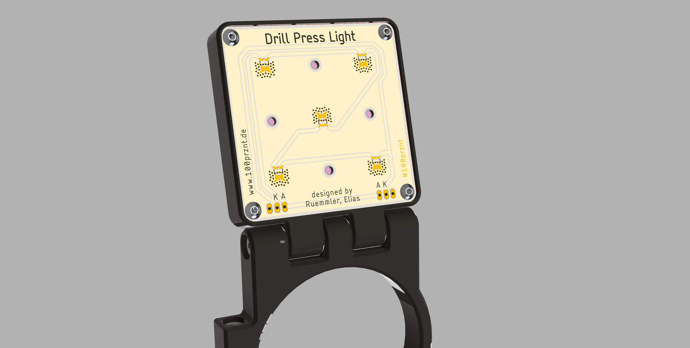

# Drill Press Light
 
LED lamp for mounting on a table or stand drill with a 60 mm rail.

The repository contains Eagle CAD data and a complete set of [Gerber data](https://github.com/100prznt/OptiDrill_Lamp/blob/main/LedPanel/LedPanel_v010__GERBER.zip?raw=true).

You can find the STL files for the case on PrusaPrinters.org
* [Drill Press Ligth on PrusaPrinters.org](https://www.prusaprinters.org/de/prints/125545-drill-press-light)
